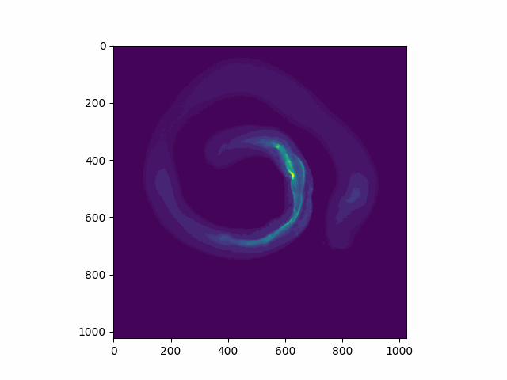

# Computer-Graphics-Final-Project

When analysing the effects of different stimuli on the microscopic roundworm c.elegans, Phd student Divyashree's work at AP lab involves measuring curvature and thickness of its intestine. Her current method of analysing this includes taking an input z-stack and making measurements in 2d from roughly a middle position of the worm.

The issue with this method is that it entirely ignores curvature and thickness in the 3D dimension. Further, given that certain parts of the image are unclear in 2D, it can be difficult to tell if they are part of the intestine or not, meaning useful information may be lost. We can estimate this information from stacks adjacent to the target image. The current method is also fully manual and in this project I aim to autmoate it

For this project, I aim to create a multi stage pipeline to move from an input z-stack to 3d representation of the microscopic worm c elegans.

### Input:

z stacks of different worms with sizes from 14-45. The below animation shows as what one of these stacks looks like.

### Stage 1

In this stage my objective is to get as close to the trimap as possible using different blurring methods to reduce noise and will threshold the result.

I will measure accuracy of this method against manual labels on the individual slices. Below is one of my labelled stacks (these are labels for the input stack above)

255 = 100% intestine, 128 = unknown, 0 = 0% intestine

I will develop my method against a different sets of input images, and will measure accuracy against my labels using Root Mean Square Error against the 3 labels of my trimap

### Stage 2

One of the difficulties in labelling the unknown parts of this problem is that what we see in a slice is sometimes out-of-focus light from slices below and above. Therefore, a line may sometimes mean intestine in a layer above or below but not in the slice itself. 

I will try to estimate the values of these unknown regions (output of stage 1). My method will likely be based on an approach similar to Gaussian Matting, along with

In this stage, I will compare predictions for unknown regions to known regions in my labels. In cases where a region is unknown in my labels, I will discuss the prediction with Divyashree to check accuracy. I will look into developing a more rigorious method to test this

### Stage 3

In this stage, I will take the known intestine regions and project them to a 3D point cloud. Perhaps after some form of interpolation, I will display this as 3D mesh of the intestine.